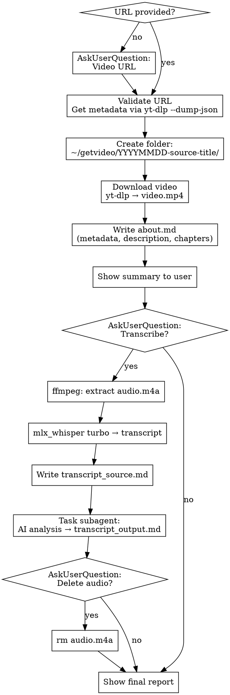

# getvideo — Download & Analyze Video

## Overview

Download video via yt-dlp, create structured folder with metadata (`about.md`), optionally transcribe with mlx-whisper turbo and produce AI analysis (TLDR, insights, TODOs).

**Requires:** yt-dlp, ffmpeg, mlx-whisper (for transcription on Apple Silicon)

## Invocation

```
/getvideo [URL]
```

If URL not provided as argument, ask via AskUserQuestion.

## Implementation Protocol



### Phase 1: SETUP

1. If no URL argument — ask via AskUserQuestion (header: "Video URL")
2. Validate URL contains a video platform domain
3. Create `~/getvideo/` if it doesn't exist
4. Get metadata:
   ```bash
   yt-dlp --dump-json "<URL>" 2>/dev/null
   ```
   Extract: `title`, `upload_date`, `channel`, `duration_string`, `view_count`, `like_count`, `description`, `chapters`, `webpage_url_domain`, `tags`
5. Build folder name: `YYYYMMDD-source-sanitized_title`
   - source = domain without www (youtube.com, vimeo.com, etc.)
   - title = transliterate, remove special chars, spaces→hyphens, lowercase, max 60 chars
   - Example: `20260219-youtube.com-how-i-turned-claude-into-design-tool`
6. Create folder `~/getvideo/<folder>/`
7. If folder already exists — AskUserQuestion: overwrite or add suffix

### Phase 2: DOWNLOAD

1. Download video:
   ```bash
   yt-dlp -f "bestvideo[ext=mp4]+bestaudio[ext=m4a]/best[ext=mp4]/best" \
     -o "$HOME/getvideo/<folder>/video.mp4" "<URL>"
   ```
2. Show download progress to user
3. Confirm downloaded file size: `ls -lh ~/getvideo/<folder>/video.mp4`

### Phase 3: ABOUT

1. Write `about.md` using Write tool:

   ```markdown
   # <Video Title>

   | Field    | Value             |
   |----------|-------------------|
   | Source   | <URL>             |
   | Channel  | <channel>         |
   | Date     | <YYYY-MM-DD>      |
   | Duration | <duration>        |
   | Views    | <views>           |
   | Likes    | <likes>           |

   ## Description

   <video description>

   ## Chapters

   - 00:00 — Intro
   - 01:30 — ...
   (if chapters available)

   ## Tags

   <comma-separated tags>
   ```

2. Show user summary: title, channel, duration, folder path

### Phase 4: TRANSCRIBE (optional)

1. Ask user via AskUserQuestion:
   - question: "Нужна транскрибация видео?"
   - header: "Transcribe"
   - options:
     - "Да" — "Извлечь аудио → mlx-whisper turbo → анализ (займёт время)"
     - "Нет" — "Только видео и about.md"

2. If "Да":

   **a) Extract audio:**
   ```bash
   ffmpeg -i "$HOME/getvideo/<folder>/video.mp4" -vn -acodec copy \
     "$HOME/getvideo/<folder>/audio.m4a"
   ```

   **b) Transcribe with mlx-whisper:**
   ```bash
   mlx_whisper "$HOME/getvideo/<folder>/audio.m4a" \
     --model mlx-community/whisper-turbo \
     --output-dir "$HOME/getvideo/<folder>/" \
     --output-format txt
   ```
   Use timeout: 600000ms for long videos.
   Note: mlx_whisper auto-detects language. No `--language` flag needed.

   **c) Save transcript** — read mlx_whisper output `.txt`, write as `transcript_source.md`:
   ```markdown
   # Transcript: <Video Title>

   **Source:** <URL>
   **Model:** mlx-whisper turbo
   **Language:** <detected language>

   ---

   <full transcript text>
   ```

   **d) AI analysis** — launch Task (subagent_type: general-purpose) with prompt:
   ```
   Проанализируй транскрипт видео "<title>" (канал: <channel>).

   Напиши анализ на РУССКОМ ЯЗЫКЕ в следующем формате:

   ## TLDR
   2-3 предложения: о чём видео и для кого.

   ## Основные идеи
   Пронумерованный список (5-10 пунктов) — ключевые мысли из видео.

   ## Инсайты
   Что нового/неочевидного можно вынести. Что автор подчёркивает.

   ## Что стоит попробовать (TODO)
   Конкретные actionable items: что можно применить на практике,
   со ссылками на инструменты/технологии из видео и кратким "зачем".

   Транскрипт:
   <transcript text>
   ```

   **e) Write result** to `transcript_output.md` using Write tool.

   **f) Ask about audio cleanup** via AskUserQuestion:
   - question: "Удалить аудио-файл после транскрибации?"
   - options: "Да (экономия места)" / "Нет (оставить)"

### Final Output

```
============================================================
VIDEO DOWNLOADED SUCCESSFULLY
============================================================
Title:      <title>
Channel:    <channel>
Duration:   <duration>
Folder:     ~/getvideo/<folder>/

Files:
  video.mp4              — <size>
  about.md               — описание и метаданные
  transcript_source.md   — транскрипт (если запрошен)
  transcript_output.md   — анализ (если запрошен)
============================================================
```

## Error Handling

| Error | Action |
|-------|--------|
| URL not recognized by yt-dlp | HALT, show error, suggest checking URL |
| Video unavailable/private | HALT, show reason from yt-dlp |
| ffmpeg not installed | HALT: `brew install ffmpeg` |
| mlx_whisper not installed | HALT: `pip3 install mlx-whisper` |
| mlx_whisper timeout (>10 min) | Warn user, suggest smaller model |
| Folder already exists | Ask: overwrite or add suffix |
